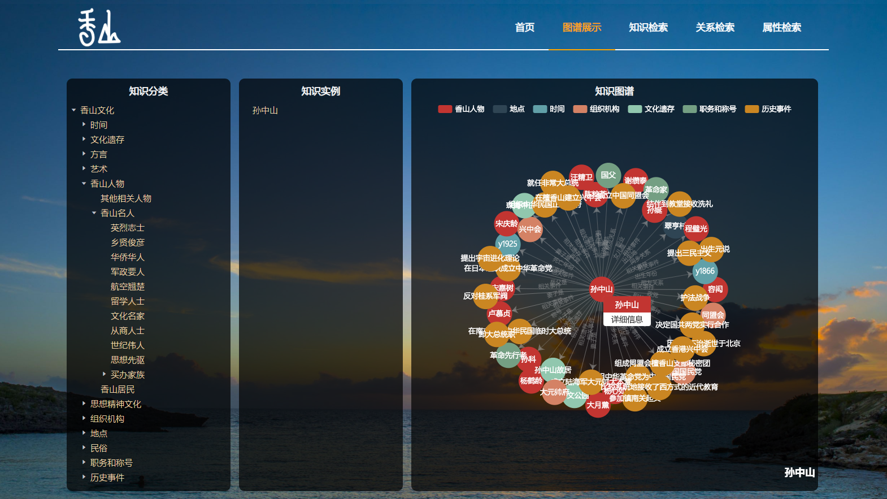
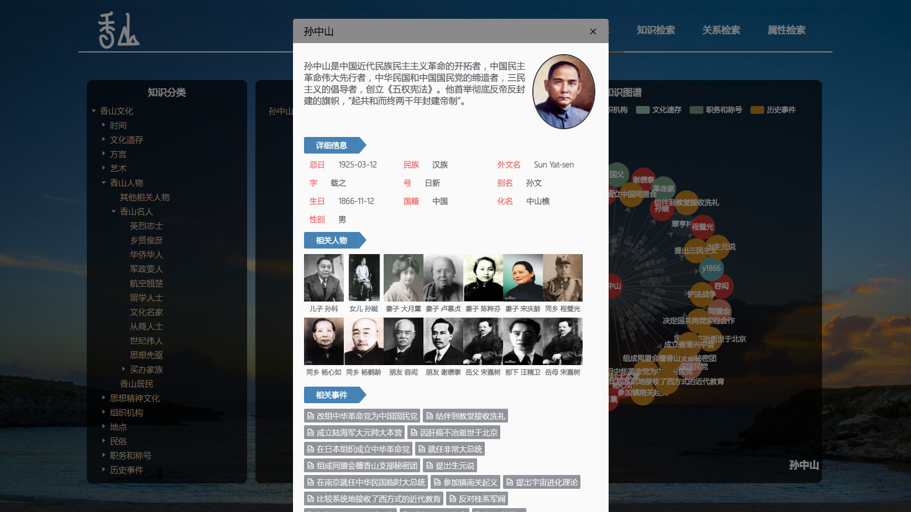
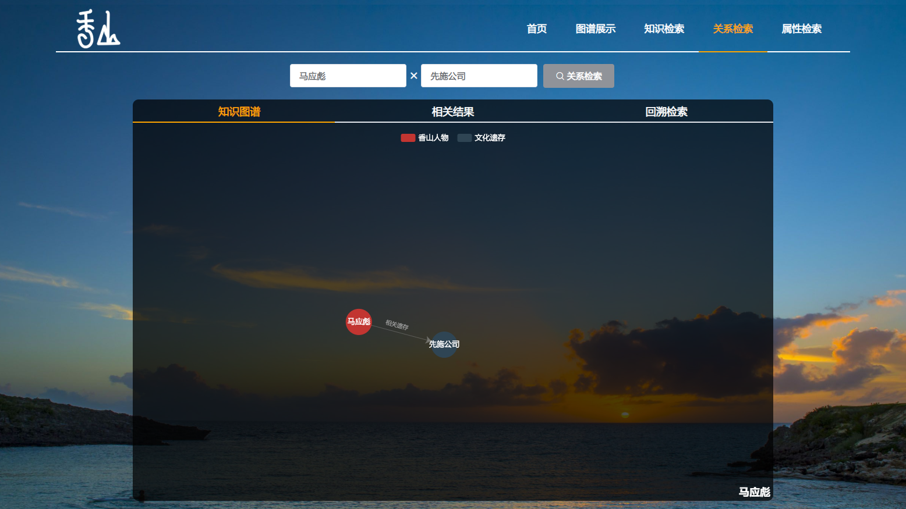
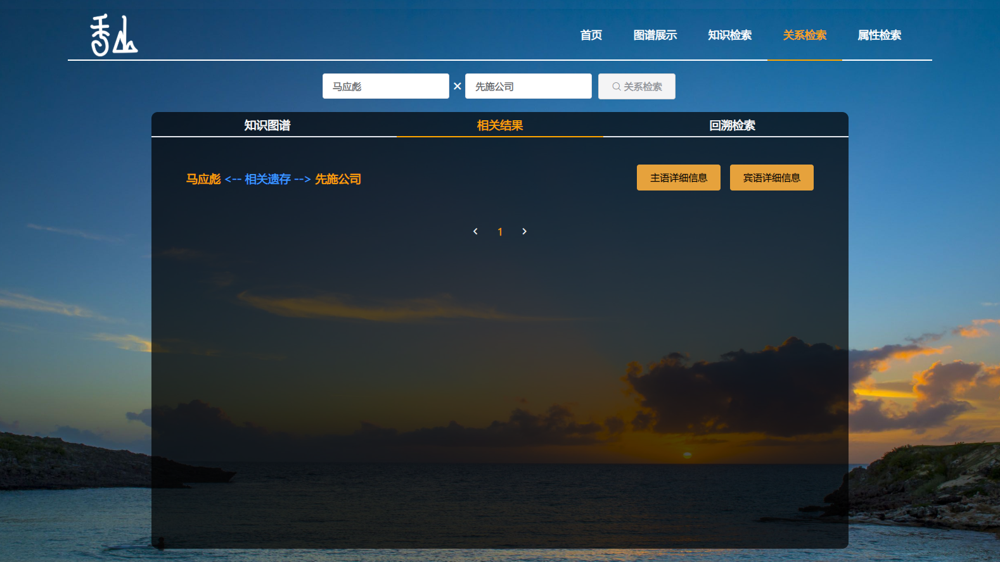
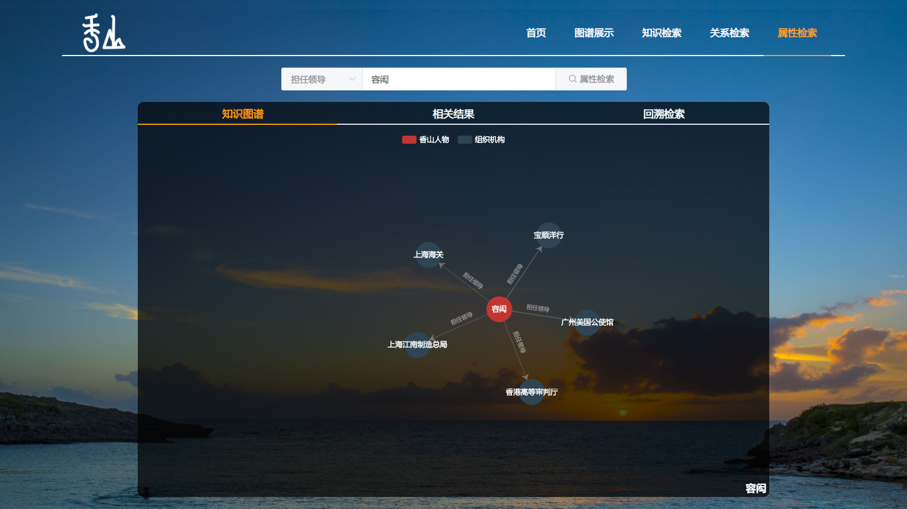

# Ontology-based Knowledge Graph Retrieval System of Xiangshan Culture: 基于本体的香山文化知识图谱检索系统

----

## 一、介绍（Introduction）

Fragrant Mountain has a rich cultural heritage and contains many kinds of content. Its rich connotation has excellent research and development value for modern times. Its existing research methods and protection methods are not ideal, and its inheritance methods lack innovation. The purpose of excavating, researching and promoting Xiangshan culture is to use Ontology technology to systematically organize and store Xiangshan culture, which is a close combination of modern information technology and traditional culture.

香山文化底蕴丰富，包含内容种类多，其丰富的内涵对现代具有很大的研究开发价值，其现有的研究方法和保护方式并不理想，传承方式也缺乏创新性。以挖掘、研究、弘扬香山文化为主旨，利用Ontology技术，将香山文化进行系统化整理和存储是现代化信息技术与传统文化的密切结合。

This system collects and understands, and studies the Xiangshan culture from books and documents and further enriches the information in the field of Xiangshan culture in combination with field research. According to the characteristics of the Xiangshan culture, the knowledge framework of the ontology of the Xiangshan cultural field is designed to add to the ontology of the Xiangshan culture. Knowledge instances, knowledge attributes, and knowledge relationships.

本系统从书籍文献资料等多处收集并了解研究了香山文化，并结合实地调研进一步丰富了香山文化领域的资料；根据香山文化的特性设计了香山文化领域本体的知识框架，为香山文化本体添加了知识实例、知识属性以及知识关系。

This system is a Xiangshan culture knowledge graph retrieval system designed and developed based on the Java web framework - Spring Boot. The system functions include knowledge retrieval, knowledge structure browsing, knowledge reasoning and knowledge visualization.

本系统是基于Java web框架——Spring Boot设计和开发的一个香山文化知识图谱检索系统，系统功能包括知识检索、知识结构浏览、知识推理以及知识可视化。

## 二、系统部分界面（Parts of the system）

